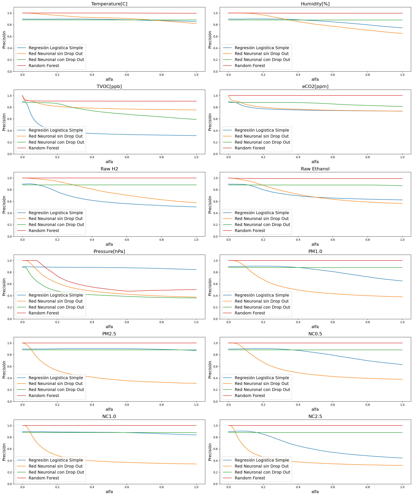

# Paper CONAIISI 2023

<p align="center">
  <a href="https://skillicons.dev">
    
  </a>
</p>

# Índice

- [Paper CONAIISI 2023](#paper-conaiisi-2023)
- [Índice](#índice)
- [Introducción](#introducción)
- [Resumen](#resumen)
- [Lista de archivos del repositorio](#lista-de-archivos-del-repositorio)

# Introducción

Este repositorio contiene el trabajo relativo al desarrollo del paper:

**Estudio comparativo de diferentes modelos de aprendizaje automático y análisis de la robustez de dichos modelos frente a fallas provocadas en los sensores en el caso de detección de incendios para ser aplicados a dispositivos de computación de borde**

El contenido del mismo está disponible en el archivo [Paper.pdf](./Paper.pdf) del presente repositorio. El mismo fue [aprobado](./Certificado%20trabajos%20aprobados%20CONAIISI-12.pdf) y compartido con la comunidad en una [disertación](./Certificado%20disertante%20CONAIISI-12.pdf) transmitida en vivo por YouTube.

Lamentablemente, a la fecha de escribir esto, el *Congreso Nacional de Ingeniería Informática / Sistemas de Información(CONAIISI) 2023* no ha publicado aún la memoría donde se recogen los trabajos aprobados y los vídeos de las presentaciones no están disponibles en YouTube.

# Resumen

El trabajo trabaja con modelos de Aprendizaje Automático aplicados al caso de la detección de incendios mediante dispositivos inteligentes.

Se estudiaron dos tipos de errores:

* Un fallo total de un sensor.
* Un sensor que mide valores de forma incorrecta.

De los 3 modelos evaluados, Regresión Logística Simple, Redes Neuronales Multicapa y Random Forest, el Random Forest demostró una mayor solvencia en todos los aspectos:

* Tiempo de entrenamiento.
* Precisión en el caso base.
* Tolerancia a la introducción de errores.

# Lista de archivos del repositorio

* [Paper.pdf](./Paper.pdf): El paper presentado ante el CONAIISI 2023.
* [paper_conaiisi.ipynb](./paper_conaiisi.ipynb): Jupyter Notebook en el que se llevó a cabo el trabajo que permitió producir el paper.
* [requires.txt](./requires.txt): Archivo con los paquetes de python que es necesario instalar para ejecutar el notebook. Recordar que es posible utilizar ```pip install -r requires.txt```
* [Certificado trabajos aprobados CONAIISI-12.pdf](./Certificado%20trabajos%20aprobados%20CONAIISI-12.pdf): Certificado de que el trabajo fue aprobado.
* [Certificado disertante CONAIISI-12.pdf](./Certificado%20disertante%20CONAIISI-12.pdf): Certificado de que el trabajó fue presentado en el congreso.
* [Diapositivas.pdf](./Diapositivas.pdf): Diapositivas utilizadas para presentar el trabajo.
* [smoke_detection_iot.csv](./smoke_detection_iot.csv): El dataset utilizado para desarrollar el paper. Cabe aclarar que no es un dataset original sino que es un dataset desarrollado por otros investigadores dispobible en [Kaggle](https://www.kaggle.com/datasets/deepcontractor/smoke-detection-dataset)

